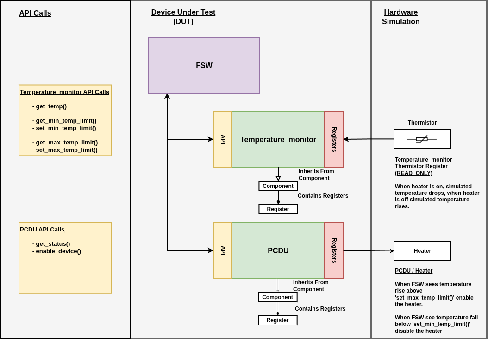

# FSW Thermal Control Simulation

## Prompt

'Develop an architecture that allows simulating a Flight Software (FSW) and simulated spacecraft components that communicate with each other. Common systems can be found online. Additionally, implement an example in which the FSW performs a simple thermal control, where the thermistors belong to the simulated components, and the heaters are lines controlled by a simulated Power Conditioning and Distribution Unit (PCDU) (another component).'

## Overview

The FSW was created to command and control several components. To make components extensible within the project a **component** class was created. Every component is composed of **registers**. Each register is a `uint32_t` and has an access type of either `READ_ONLY`, `WRTIE_ONLY`, or `READ_WRITE`.

The FSW communicates to each of the components using their unique API. The API of the component reads and/or writes to the components register set when applicable. **The FSW does not have access to any component register set**.

*Note*: The prompt infers that the `thermistor` and `PCDU` are both components. This project implements the PCDU as a component but **implements the thermistors as READ-ONLY registers on the Temperature Monitor**. The temperature_monitor currently houses two such thermistors.

## Repo Organization

```bash
$ tree
.
├── docs
│   ├── fsw.drawio
│   └── fsw.png
├── fsw.cpp
├── Makefile
├── README.md
└── src
    ├── components
    │   ├── PCDU.cpp
    │   ├── PCDU.hpp
    │   ├── temperature_monitor.cpp
    │   └── temperature_monitor.hpp
    ├── primitives
    │   ├── component.cpp
    │   ├── component.hpp
    │   ├── register.cpp
    │   └── register.hpp
    └── simulation
        ├── thermal_sim.cpp
        └── thermal_sim.hpp
```

## Requirements

- C++17
- GNU Make

## Build and Run

```bash
cd fsw
make
./fsw
```

## Temperature Monitor (Component)

The following section defines the API and register set of the **Temperature Monitor**.

### API

**Temperature Monitor** provides access to two simulated thermistors: **THERMISTOR0** and **THERMISTOR1**.

The constructor accepts **CELSIUS** or **FEHRENHEIT**; it defaults to **CELSIUS**. Each thermistor starts with a minimum limit of 0°C and a maximum limit of 40°C.

| API Call                             | Description                                                   |
|--------------------------------------|---------------------------------------------------------------|
| report_temps()                       | Returns a text report containing both thermistor readings.    |
| get_temp(thermistor)                 | Returns the latest temperature reading of a given thermistor. |
| set_min_temp_limit(thermistor, temp) | Sets the minimum temperature limit of a given thermistor.     |
| get_min_temp_limit(thermistor)       | Returns the minimum temperature limit of a given thermistor.  |
| set_max_temp_limit(thermistor, temp) | Sets the maximum temperature limit of a given thermistor.     |
| get_max_temp_limit(thermistor, temp) | Returns the maximum temperature limit of a given thermistor.  |

The minimum and maximum temperature limit setters throw an error if the minimum exceeds the maximum or if the maximum is below the minimum.

Example usage:

```bash
Temperature_monitor temp_monitor(CELSIUS);
temp_monitor.report_temps();
temp_monitor.get_temp(THERMISTOR1);
temp_monitor.set_min_temp_limit(THERMISTOR0, 0.0);
temp_monitor.get_min_temp_limit(THERMISTOR1, 25.0);
```

**Thermistor readings are updated by the thermal simulation, the API does not provide a set_temperature() call.**

### Register Map

The following registers are housed in the Temperature Monitor:

| Offset     | Register              | Access | Reset      | Description                       |
|------------|-----------------------|--------|------------|-----------------------------------|
| 0x00000000 | THERMISTOR0_TEMP      | RO     | 0x00000000 | Thermistor 0 current temperature. |
| 0x00000004 | THERMISTOR0_MIN_LIMIT | RW     | 0x00000000 | Thermistor 0 minimum limit.       |
| 0x00000008 | THERMISTOR0_MAX_LIMIT | RW     | 0x00000028 | Thermistor 0 maximum limit.       |
| 0x0000000C | THERMISTOR1_TEMP      | RO     | 0x00000000 | Thermistor 1 current temperature. |
| 0x00000010 | THERMISTOR1_MIN_LIMIT | RW     | 0x00000000 | Thermistor 1 minimum limit.       |
| 0x00000014 | THERMISTOR1_MAX_LIMIT | RW     | 0x00000028 | Thermistor 1 maximum limit.       |

The FSW reads temperature values and gets/sets minimum and maximum limits through the **Temperature Monitor** API. The thermal simulator updates the `READ-ONLY` temperature registers through a separate hardware-side simulation interface. The temperature monitor register addresses are hidden from the public API, the FSW does not need them to use the components public API.

## Power Conditioning and Distribution Unit (PCDU) (Component)

The following section defines the API and register set of the **PCDU**.

### API

The **PCDU** provides access to two heater power lines: **HEATER0** and **HEATER1**. Both start disabled.

| API Call                          | Description                                 |
|-----------------------------------|---------------------------------------------|
| set_heater_enable(heater, enable) | Enables are disables the selected heater.   |
| get_status(heater)                | Returns a status string for a given heater. |

Example usage:
```bash
PCDU pcdu;
pcdu.set_heater_enable(HEATER0, true);
pcdu.set_heater_enable(HEATER1, false);
std::cout << pcdu.get_status(HEATER0) << '\n';
```

### Register Map

Each heater has a `WRITE-ONLY` power control register. Writing a `1` enables the heater; write a `0` disables the heater.

| Offset     | Register              | Access | Reset      | Description                       |
|------------|-----------------------|--------|------------|-----------------------------------|
| 0x00000000 | HEATER0_PWR           | WO     | 0x00000000 | Enables power to Heater 0         |
| 0x00000004 | HEATER1_PWR           | WO     | 0x00000000 | Enables power to Heater 1         |

The FSW enables and disables (set_heater_enable) through the **PCDU** API. The thermal simulator 'reads-from' the `WRITE-ONLY` power registers through a separate hardware-side simulation interface. The PCDU register addresses are hidden from the public API, the FSW does not need them to use the components public API.

## Thermal Simulation

**Thermal_sim** connects the PCDU's heater commands to the temperature monitor's thermistor readings. **The thermal sim is a friend to both components and has access to each of the components private simulation methods: `PCDU::sim_heater_powered` to read heater state and `Temperature_monitor::sim_temp_update()` to update read-only thermistor readings based on the state of the heater.

Its constructor sets both simulated areas to the supplied initial temperature and writes those readings to the monitor. Each **tick()** then changes the temperatures according to heater state:

| Area | Heater  | Thermistor  | Heater On     | Heater Off    |
|------|---------|-------------|---------------|---------------|
| 0    | HEATER0 | THERMISTOR0 | +1 per tick() | -1 per tick() |
| 1    | HEATER1 | THERMISTOR1 | +2 per tick() | -2 per tick() |

## Block Diagram


